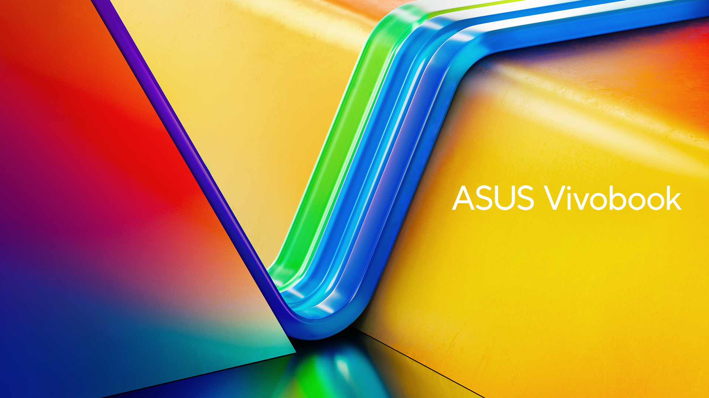

# **Prueba de markDown**

## Encabezados

# Este es un titulo h1
## Este es un titulo h2
###### Este es un titulo h6

## Para enfasis

*Este texto estara en italic o cursiva*   
_Asi tambien estara_  

**Este texto estara en negrita o borde grueso**  
__Asi tambien estara__  

_Tambien **podemos** combinarlos_  
__O de esta__ _forma_ __podemos hacerlo tambien__

## Saltos de linea
con dos espacios al finalizar la palabra se genera salto de linea  

## Listas

## Desordenadas
* Item 1
* Item 2
* Item 3

## Ordenadas
1. Item 1
2. Item 2
3. Item 3

## Imagenes

## Enlaces

Hacer click en el siguiente enlace [Ir a dasboard Alura+ Oracle](https://app.aluracursos.com/dashboard)

>Estamos probando parrafos de bloques aqui: unamarinerito me mando un papel , a ver si queria casarme con el , yo agarre la pluma y le conteste, hombre sin dinero no busca mujer. lalalalalalalalallalaalelelelelelele eleleellelelelelelelel
>
>>Este seria otro texto que no va a ser tan largo porque ya se vio en la idea principal

## Tablas

| Columna izquierda  | Columna Deracha  |
|------------------  | ---------------- |
| item 1             | Descripcion 1    |
| Item 2             | Descripcion 2    |
|------------------  | ---------------- |

 _**NOTA**: En la configuracion de la Columna se pueden colocar dos puntos (:) para indicar el ajuste del texto en la celda, por ejempo (----------:) ajustaria el texto a la derecha (:----------:) ajustaria el texto en el centro. Y solo se puede hacer una sola configuracion como se ve en la imagen cualquier cosa que se coloque abajo sera considerado texto_